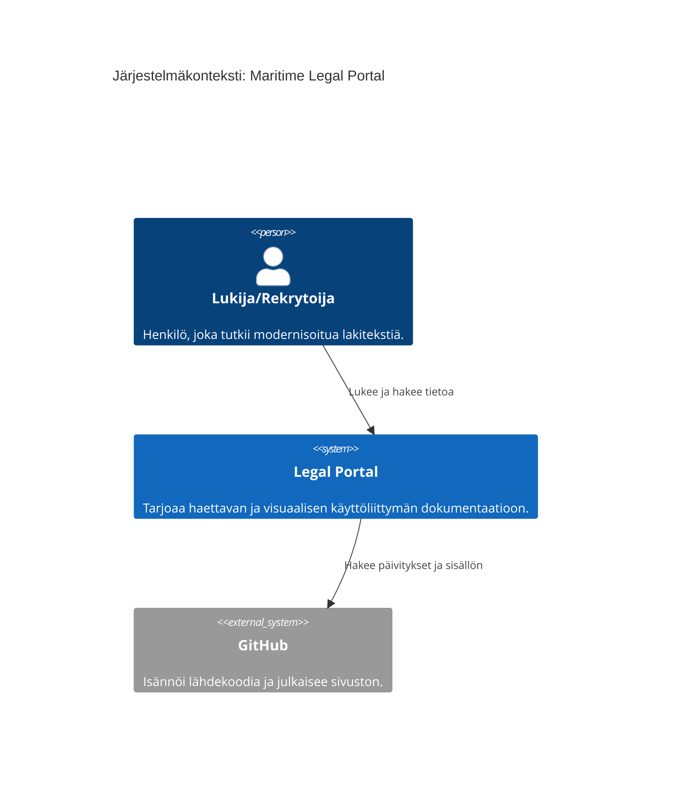
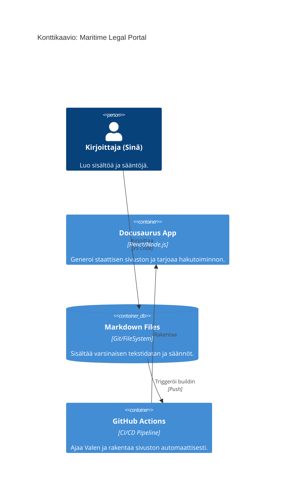

# Portaalin arkkitehtuuri (C4-malli)

Tämä kaavio kuvaa portaalin teknistä rakennetta C4-mallin mukaisesti.

## Taso 1: Järjestelmäkonteksti

# Portaalin tekninen rakenne

Tämä C4-malli kuvaa, miten portaali on rakennettu.

