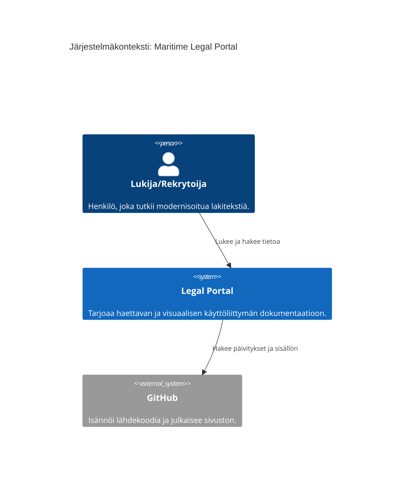

# Portaalin arkkitehtuuri (C4-malli)

Tämä kaavio kuvaa portaalin teknistä rakennetta C4-mallin mukaisesti.

## Taso 1: Järjestelmäkonteksti

```mermaid
C4Context
    title Järjestelmäkonteksti: Maritime Legal Portal
    
    Person(user, "Lukija/Rekrytoija", "Henkilö, joka tutkii modernisoitua lakitekstiä.")
    System(portal, "Legal Portal", "Tarjoaa haettavan ja visuaalisen käyttöliittymän dokumentaatioon.")
    System_Ext(github, "GitHub", "Isännöi lähdekoodia ja julkaisee sivuston.")

    Rel(user, portal, "Lukee ja hakee tietoa")
    Rel(portal, github, "Hakee päivitykset ja sisällön")
```