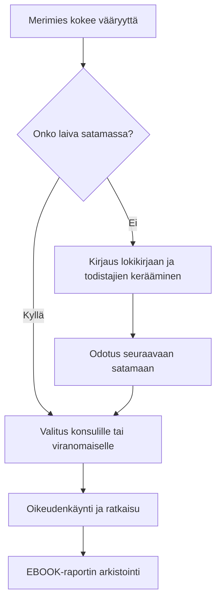
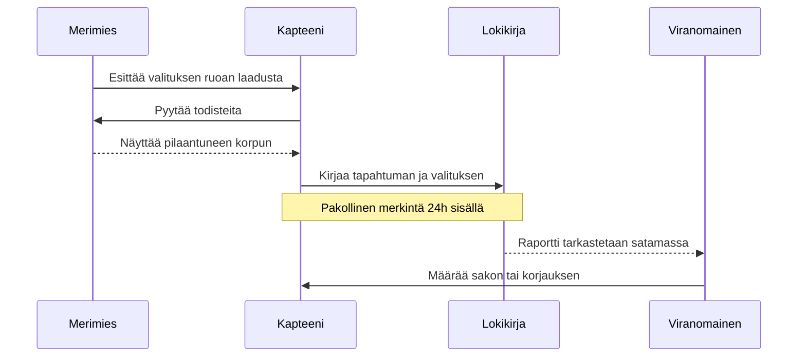

# Oikeusprosessin kulku merellä

Tämä kaavio kuvaa prosessia, jota noudatetaan, kun merimies kohtaa epäoikeudenmukaisuutta.

## Kommunikaatioprosessi: Kapteeni vs. Merimies

Tämä sekvenssikaavio kuvaa viestinnän kulkua virallisessa valitustilanteessa.

@startuml
!include [https://raw.githubusercontent.com/plantuml-stdlib/C4-PlantUML/master/C4_Container.puml](https://raw.githubusercontent.com/plantuml-stdlib/C4-PlantUML/master/C4_Container.puml)

skinparam shadowing false

start
:Epäoikeudenmukaisuus tapahtuu;
:Dokumentoi tapahtuma lokikirjaan;
if (Kapteeni osallinen?) then (kyllä)
  :Ota yhteys varustamoon suoraan;
else (ei)
  :Raportoi kapteenille;
endif
:Ota yhteys ammattiliittoon/ITF;
stop
@enduml