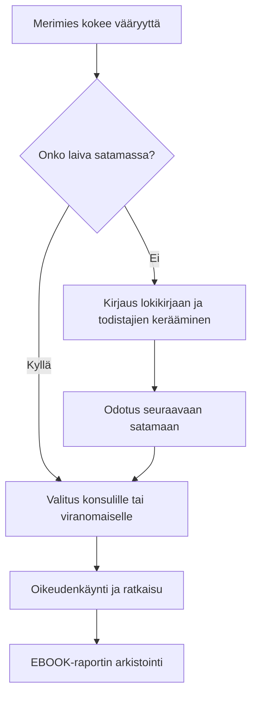
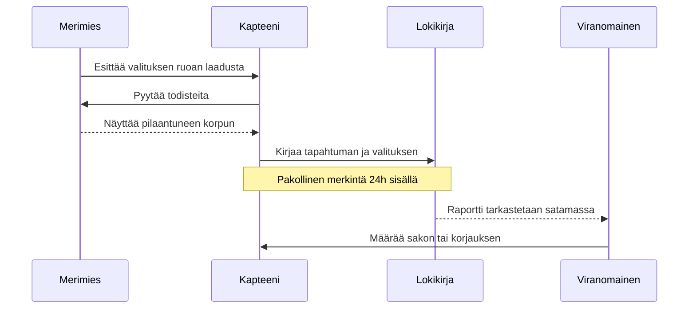

# Oikeusprosessin kulku merellä

Tämä kaavio kuvaa prosessia, jota noudatetaan, kun merimies kohtaa epäoikeudenmukaisuutta.

## Kommunikaatioprosessi: Kapteeni vs. Merimies

Tämä sekvenssikaavio kuvaa viestinnän kulkua virallisessa valitustilanteessa.

